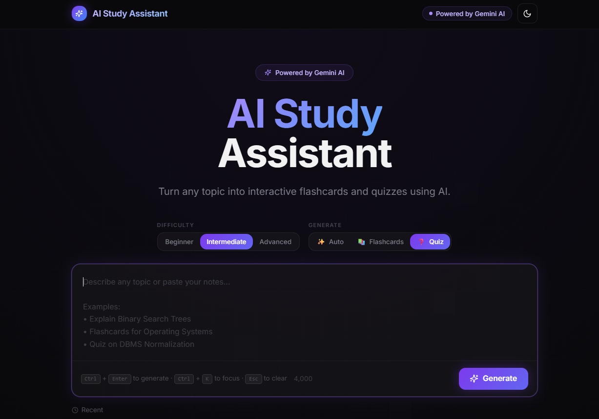
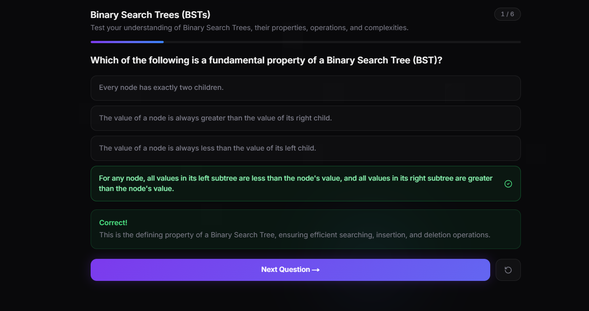
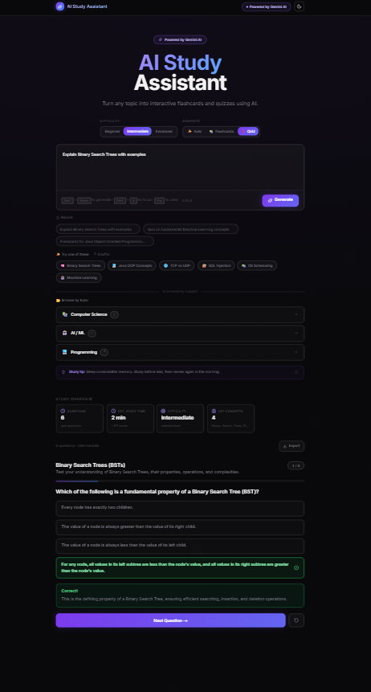

# 📚 AI Study Assistant

An AI-powered Study Assistant built with **Next.js**, **React**, **TypeScript**, and **OpenRouter AI**. It converts natural language prompts into interactive learning tools such as quizzes, flashcards, summaries, timelines, and concept maps, making studying more engaging and efficient.

---

## ✨ Features

### 🤖 AI-Powered Study Tool Generation
- Generate interactive learning tools from simple text prompts.
- Supports multiple study formats:
  - Quizzes
  - Flashcards
  - Study Summaries
  - Timelines
  - Concept Maps
  - Learning Guides

### 💡 Smart Prompt Experience
- Prompt suggestions
- Topic browser
- Recent prompt history
- Input validation
- AI generation status updates

### 📖 Interactive Learning Dashboard
- Continue Learning section
- Personalized study tips
- Organized learning interface
- Responsive dashboard

### 🛡️ Better User Experience
- Loading states
- Error handling
- Recovery options
- Empty state components
- Modern responsive design
- Dark mode support

### 📤 Export & Recovery
- Export generated study tools
- Recovery support for interrupted generations

---

## 🛠️ Tech Stack

### Frontend
- Next.js 15
- React 19
- TypeScript
- Tailwind CSS

### AI
- OpenRouter API
- OpenAI SDK

### Validation
- Zod

### Development
- ESLint
- npm

---

## 📂 Project Structure

```text
app/
├── api/
│   └── generate/
├── components/
├── hooks/
├── lib/
│   ├── ai/
│   ├── recovery/
│   └── schemas/
├── types/
└── utils/
```

---

## 🚀 Getting Started

### Clone the repository

```bash
git clone https://github.com/Nairayadav/study-assistant-ai.git
```

### Navigate to the project

```bash
cd study-assistant-ai
```

### Install dependencies

```bash
npm install
```

### Configure environment variables

Create a `.env.local` file:

```env
OPENROUTER_API_KEY=your_openrouter_api_key
```

### Start the development server

```bash
npm run dev
```

Visit:

```
http://localhost:3000
```

---

## 🏗️ Build

```bash
npm run build
```

---

## 📸 Screenshots

> Create a folder named `screenshots` in the project root and add your images.

### Home Page



### Prompt Generation



### Dashboard



---

## 📌 Future Improvements

- User authentication
- Save generated study history
- PDF export
- Voice-based prompts
- AI Tutor Chat
- Progress analytics
- Spaced repetition learning
- Collaborative study sessions

---

## 👩‍💻 Author

**Naira Yadav**

- GitHub: https://github.com/Nairayadav
- LinkedIn: https://www.linkedin.com/in/naira-yadav-0141802a8

---

## 📄 License

This project was developed as part of the **FLAM Frontend Internship Assignment** for educational and evaluation purposes.
